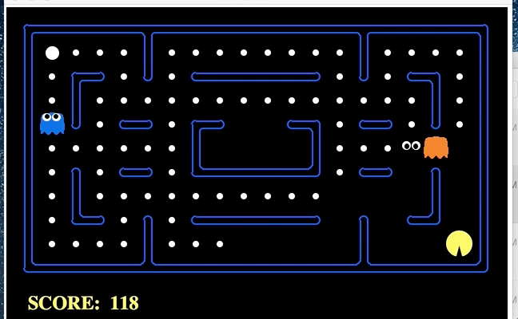
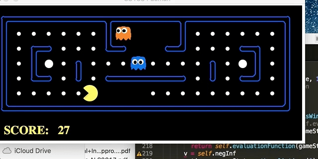
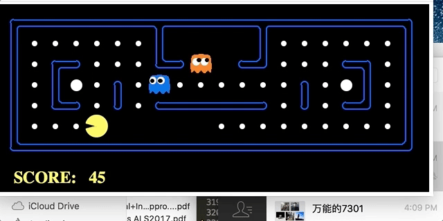

# Pacman-AI-game

This is a Pacman Game but integrated with Artificial Intelligence. It is based on [UC Berkeley AI Packman Project](http://ai.berkeley.edu/project_overview.html) which implements game graphical interface and simple game rules. This project makes following improvement:
1. modify the evaluation function to provide a more reasonable better evaluation function
2. add minmax agent which implements minmax search algorithm 
3. add alpha beta pruning agent which is an improved version of minmax agent to greatly accelerate search speed.

##### new evaluation function

##### minmax agent

##### alpha-beta pruning

